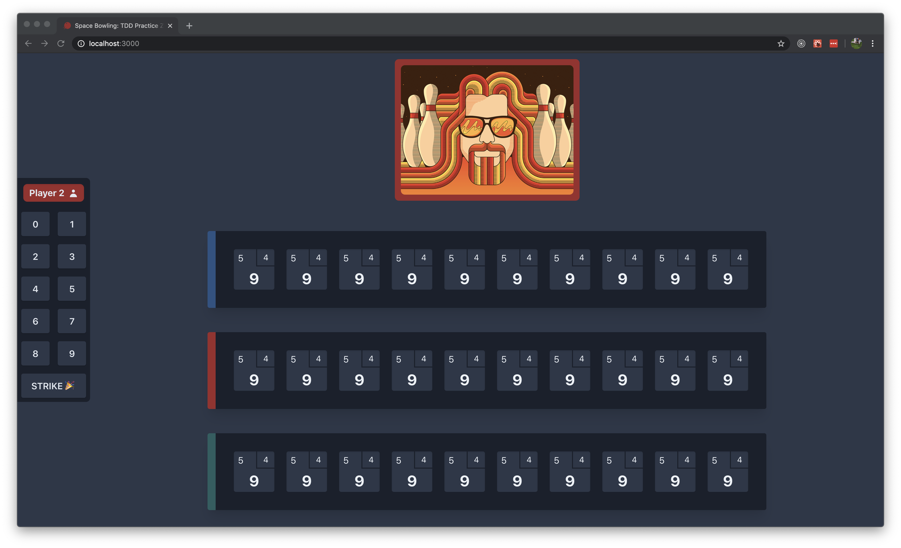

# TDD Bowling Game
A fun template to practice test-driven development with [@testing-library/react](https://github.com/testing-library/react-testing-library)
Inspired by Uncle Bob's famous [Bowling Game Kata](https://kata-log.rocks/bowling-game-kata)

# Welcome to React Bowling
The local bowling alley needs an app to keep a score on their bowling games. 
You figure this could be your big break into the world of Bowling Software!

You show up at the Bowling alley and see that they have an initial design up for their app, 
but with no functionality :O

As it is they have a list of requirements ready:

## Requirements
* `rolling` Clicking any of the numbered buttons should update the scoreboard with the number of pins knocked down for the roll.

* `game score` The game consists of 10 frames.  In each frame the player has
               two opportunities to knock down 10 pins.  The score for the frame is the total
               number of pins knocked down, plus bonuses for strikes and spares.
               
* `spare` A spare is when the player knocks down all 10 pins in two tries.  The bonus for
          that frame is the number of pins knocked down by the next roll.  So in frame 3
          above, the score is 10 (the total number knocked down) plus a bonus of 5 (the
          number of pins knocked down on the next roll.)
          
* `strike` A strike is when the player knocks down all 10 pins on his first try.  The bonus
           for that frame is the value of the next two balls rolled.
           
* `10th frame` In the tenth frame a player who rolls a spare or strike is allowed to roll the extra
               balls to complete the frame.  However no more than three balls can be rolled in
               tenth frame.
